# PlasticWorld Backend API

Production-grade messaging platform backend with end-to-end encryption, built with Node.js, TypeScript, Express, PostgreSQL, Redis, and Socket.io.

## 🚀 Features

- **Real-time Messaging**: WebSocket support with Socket.io
- **End-to-End Encryption**: Signal Protocol implementation
- **Scalable Architecture**: Microservices-ready design
- **High Performance**: Optimized for <100ms latency
- **Security First**: JWT authentication, rate limiting, input validation
- **Production Ready**: Comprehensive logging, error handling, health checks

## 📋 Prerequisites

**For Local Development (Mac):**
- Node.js >= 18.0.0
- npm >= 9.0.0
- Docker and Docker Compose (for local databases)
- PostgreSQL 15+ (via Docker)
- Redis 7+ (via Docker)

# PlasticWorld Backend - Architecture & API Design Diagrams

This document contains detailed Mermaid diagrams for visualizing the PlasticWorld backend architecture, API design, data flow, and system components.

## 📖 How to View These Diagrams

**Important:** Each diagram below is a separate Mermaid code block. To view them:

1. **GitHub/GitLab:** Diagrams render automatically when viewing this file on GitHub
2. **VS Code:** Install the "Markdown Preview Mermaid Support" extension
3. **Mermaid Live Editor:** Copy each diagram's code block (between ` ```mermaid ` and ` ``` `) and paste into https://mermaid.live
4. **Other Markdown Viewers:** Ensure your viewer supports Mermaid diagrams

**⚠️ Do NOT copy the entire file** - each diagram must be viewed separately!

---

## 📐 System Architecture Overview


---

## 🔄 Authentication Flow


---

## 🔄 Token Refresh Flow


---

## 💬 Message Sending Flow


---

## 📨 Message Delivery & Read Receipts


---

## 🔐 End-to-End Encryption Flow (Signal Protocol)

```mermaid
sequenceDiagram
    participant Alice
    participant Backend
    participant PostgreSQL
    participant Redis
    participant Bob
    
    Note over Alice: First message to Bob
    
    Alice->>Backend: GET /encryption/keys/prekey-bundle/:bobId/:deviceId
    Backend->>PostgreSQL: Get Bob's keys<br/>{identityKey, signedPreKey, oneTimePreKey}
    PostgreSQL-->>Backend: Prekey bundle
    Backend-->>Alice: Prekey bundle
    
    Alice->>Alice: Perform X3DH key exchange<br/>Generate shared secret (root key)
    
    Alice->>Backend: POST /encryption/session/establish<br/>{recipientUserId, recipientDeviceId}
    Backend->>Backend: Perform X3DH<br/>(server-side validation)
    Backend->>Redis: Store session<br/>{sessionId, rootKey, chainKeys}
    Redis-->>Backend: Session stored
    Backend-->>Alice: Session established
    
    Alice->>Alice: Initialize Double Ratchet<br/>{rootKey, chainKeys}
    
    Note over Alice: Encrypt message
    
    Alice->>Alice: Encrypt with Double Ratchet<br/>{plaintext → ciphertext + nonce}
    
    Alice->>Backend: POST /messages<br/>{encryptedContent, encryptedKey}
    Backend->>PostgreSQL: Store encrypted message<br/>(server never sees plaintext)
    PostgreSQL-->>Backend: Message stored
    
    Backend->>Bob: Deliver via WebSocket<br/>{encryptedContent, encryptedKey}
    
    Bob->>Bob: Decrypt with Double Ratchet<br/>{ciphertext + nonce → plaintext}
    
    Note over Alice,Bob: Subsequent messages use<br/>Double Ratchet only<br/>(no X3DH needed)
```



---

## 👥 Friendship Management Flow


---

## 🔌 WebSocket Connection & Events


---

## 🗄️ Database Schema Relationships


---

## 🔄 Real-Time Typing Indicators


---

## 📊 API Request/Response Flow


---

## 🚀 Deployment Architecture


---

## 🔐 Security Architecture


---

## 📈 Performance Optimization


---

## 🔄 Complete Message Lifecycle


---

## 📱 Multi-Device Support


---

**Last Updated:** January 9, 2026  
**Diagram Format:** Mermaid  
**View Instructions:** Use Mermaid-compatible viewers (GitHub, VS Code with Mermaid extension, Mermaid Live Editor)

## 🔐 Security Features

- Helmet.js for security headers
- CORS configuration
- Rate limiting
- JWT authentication (to be implemented)
- Input validation (to be implemented)
- SQL injection prevention (parameterized queries)
- XSS protection

## 📊 Monitoring

- Winston logger with daily rotation
- Structured JSON logging
- Health check endpoints
- Error tracking (Sentry integration in future phases)

## 🚀 Deployment

**For Production Deployment**, see the comprehensive guide: [DEPLOYMENT.md](./DEPLOYMENT.md)

**Key Points:**
- **Development**: Use Docker Compose on Mac for local databases
- **Production**: PostgreSQL and Redis installed directly on server
- Deployment guide includes: server setup, PM2, Nginx, SSL, backups

## 🚧 Development Phases

### ✅ Phase 1: Foundation (Current)
- Project setup with TypeScript
- Express app configuration
- PostgreSQL and Redis connections
- Logging and error handling
- Health check endpoint
- Docker Compose setup

### 🔜 Phase 2: Authentication Service
- Firebase Admin SDK integration
- JWT token generation and validation
- User registration and login
- Session management
- Password hashing

### 🔜 Phase 3: User Service
- User profile CRUD operations
- User search functionality
- Profile picture upload
- User status management

### 🔜 Phase 4: Friendship Service
- Friend request management
- State machine for friendship status
- Block/unblock functionality

### 🔜 Phase 5: Messaging Service
- REST API for messages
- WebSocket server setup
- Message queue for offline users
- Read receipts and delivery status

### 🔜 Phase 6: Encryption Service
- Key exchange (X3DH protocol)
- Double Ratchet implementation
- Key storage and rotation

### 🔜 Phase 7-10: Advanced Features
- Media handling
- Typing indicators
- Online status
- Notifications
- Performance optimization

## 🐛 Troubleshooting

### Database Connection Issues

```bash
# Check if PostgreSQL is running
docker-compose ps

# Check PostgreSQL logs
docker-compose logs postgres

# Test connection manually
docker-compose exec postgres psql -U postgres -d plasticworld_db
```

### Redis Connection Issues

```bash
# Check if Redis is running
docker-compose ps

# Check Redis logs
docker-compose logs redis

# Test connection manually
docker-compose exec redis redis-cli ping
```

### Port Already in Use

If port 3000 is already in use, change it in `.env`:

```env
PORT=3001
```

## 📚 API Documentation

API documentation will be available at `/api/v1/docs` (to be implemented in future phases).

## 🤝 Contributing

1. Create a feature branch
2. Make your changes
3. Run tests and linting
4. Submit a pull request

## 📄 License

MIT

## 👥 Support

For issues and questions, please open an issue on GitHub.

---

**Note**: This is Phase 1 of the implementation. Additional features will be added in subsequent phases.
