# PlasticWorld Backend API

A production-ready, open-source messaging backend API with end-to-end encryption support. Built with Node.js, TypeScript, Express, PostgreSQL, Redis, and Socket.io.

**Developed and Designed by [Yaduraj Singh](https://github.com/yadurajsingh)**

## ✨ Features

- 🔐 **End-to-End Encryption** - Signal Protocol implementation for secure messaging
- 💬 **Real-time Messaging** - WebSocket support with Socket.io
- 👥 **User Management** - Firebase authentication, user profiles, friend requests
- 🔒 **Security First** - JWT authentication, rate limiting, input validation, CORS
- ⚡ **High Performance** - Optimized queries, connection pooling, Redis caching
- 📊 **Production Ready** - Comprehensive logging, error handling, health checks
- 🚀 **RESTful API** - Clean, well-documented REST endpoints
- 🔌 **WebSocket Events** - Real-time notifications and updates

## 🚀 Quick Start

### Prerequisites

- Node.js >= 18.0.0
- npm >= 9.0.0
- Docker & Docker Compose (recommended) OR PostgreSQL 15+ and Redis 7+

### Installation

1. **Clone the repository**
```bash
git clone https://github.com/yourusername/plasticworld-backend.git
cd plasticworld-backend
```

2. **Install dependencies**
```bash
npm install
```

3. **Set up environment variables**
```bash
cp .env.example .env
```

Edit `.env` with your configuration (see [.env.example](./.env.example) for all options).

4. **Set up databases with Docker Compose** (recommended)
```bash
# Start PostgreSQL and Redis
docker-compose up -d

# Verify containers are running
docker-compose ps
```

5. **Run database migrations**
```bash
npm run db:migrate
```

6. **Build TypeScript**
```bash
npm run build
```

7. **Start the server**
```bash
# Development (with hot reload)
npm run dev

# Production
npm start
```

The API will be available at `http://localhost:3000`

## 🐳 Docker

### Development Setup

The project includes `docker-compose.yml` for easy local development with PostgreSQL and Redis.

#### Start Services
```bash
# Start PostgreSQL and Redis
docker-compose up -d

# View logs
docker-compose logs -f

# Stop services
docker-compose down

# Stop and remove volumes (clean slate)
docker-compose down -v
```

#### Environment Variables for Docker
The `docker-compose.yml` uses environment variables from your `.env` file:
- `DB_NAME`, `DB_USER`, `DB_PASSWORD` - PostgreSQL configuration
- `REDIS_PASSWORD` - Redis password (optional)

### Dockerfile

The project includes a production-ready `Dockerfile` with multi-stage build:

```bash
# Build the Docker image
docker build -t plasticworld-backend .

# Run the container
docker run -p 3000:3000 --env-file .env plasticworld-backend
```

#### Dockerfile Features
- Multi-stage build for optimized image size
- Non-root user for security
- Health check endpoint
- Proper signal handling with dumb-init
- Production dependencies only

### Docker Compose for Full Stack

You can extend `docker-compose.yml` to include the backend API:

```yaml
services:
  api:
    build: .
    ports:
      - "3000:3000"
    env_file:
      - .env
    depends_on:
      - postgres
      - redis
    networks:
      - plasticworld-network
```

Then run:
```bash
docker-compose up --build
```

## 📚 API Documentation

### Base URL
- **Development**: `http://localhost:3000/api/v1`
- **Production**: `https://your-domain.com/api/v1`

### WebSocket
- **Development**: `ws://localhost:3000`
- **Production**: `wss://your-domain.com`

### Endpoints

#### Authentication
- `POST /auth/google-signin` - Sign in with Google (Firebase)
- `POST /auth/refresh` - Refresh access token
- `POST /auth/logout` - Logout and invalidate session
- `POST /auth/profile-complete` - Complete user profile after first sign-in

#### Users
- `GET /users/me` - Get current user profile
- `PUT /users/me` - Update current user profile
- `GET /users/search` - Search users by username/email
- `GET /users/:userId` - Get public user profile

#### Friends
- `GET /friends` - Get friends list
- `POST /friends/request` - Send friend request
- `POST /friends/:friendshipId/accept` - Accept friend request
- `POST /friends/:friendshipId/reject` - Reject friend request
- `DELETE /friends/:friendshipId` - Remove friend
- `POST /friends/:userId/block` - Block user
- `DELETE /friends/:userId/block` - Unblock user

#### Messages
- `POST /messages` - Send a message
- `GET /messages` - Get messages (with pagination)
- `GET /messages/:messageId` - Get specific message
- `PUT /messages/:messageId` - Edit message
- `DELETE /messages/:messageId` - Delete message
- `POST /messages/:messageId/delivered` - Mark message as delivered
- `POST /messages/:messageId/read` - Mark message as read
- `POST /messages/read` - Mark multiple messages as read

#### Encryption
- `GET /encryption/keys/prekey-bundle/:userId/:deviceId` - Get prekey bundle for key exchange
- `POST /encryption/session/establish` - Establish encryption session
- `GET /encryption/keys` - Get current user's encryption keys

#### Health
- `GET /health` - Health check endpoint

For detailed API documentation, see [API_DOCUMENTATION.md](./API_DOCUMENTATION.md)

## 🔌 WebSocket Events

### Client → Server
- `message:send` - Send a message
- `typing:start` - Start typing indicator
- `typing:stop` - Stop typing indicator
- `status:update` - Update user status

### Server → Client
- `message:received` - New message received
- `message:delivered` - Message delivered to recipient
- `message:read` - Message read by recipient
- `typing:start` - User started typing
- `typing:stop` - User stopped typing
- `user:online` - User came online
- `user:offline` - User went offline
- `friend:request:received` - New friend request
- `friend:request:accepted` - Friend request accepted

## 🏗️ Architecture

### Tech Stack
- **Runtime**: Node.js with TypeScript
- **Framework**: Express.js
- **Database**: PostgreSQL
- **Cache**: Redis
- **WebSocket**: Socket.io
- **Authentication**: Firebase Admin SDK + JWT
- **Encryption**: Signal Protocol (X3DH + Double Ratchet)
- **Logging**: Winston

### Project Structure
```
plasticworld-backend/
├── src/
│   ├── config/          # Configuration (database, redis, firebase, socket)
│   ├── middleware/       # Express middleware (auth, error handling)
│   ├── routes/          # API route handlers
│   ├── services/        # Business logic services
│   ├── migrations/      # Database migrations
│   ├── utils/           # Utilities (logger, validation)
│   ├── app.ts           # Express app setup
│   └── server.ts        # Server entry point
├── dist/                # Compiled JavaScript (generated)
├── logs/                # Log files (generated)
├── docker-compose.yml   # Docker setup for local development
├── Dockerfile           # Production Docker image
└── package.json
```

## 📐 Architecture Diagrams

### System Architecture Overview


### Authentication Flow


### Message Sending Flow


### End-to-End Encryption Flow (Signal Protocol)



### Database Schema Relationships


### API Request/Response Flow


### Token Refresh Flow


### Message Delivery & Read Receipts


### Friendship Management Flow


### WebSocket Connection & Events


### Real-Time Typing Indicators


### Complete Message Lifecycle


### Multi-Device Support


### Performance Optimization


### Security Architecture


For more detailed architecture diagrams, see [ARCHITECTURE_DIAGRAMS.md](./ARCHITECTURE_DIAGRAMS.md)

## 🔐 Security

- **Authentication**: Firebase OAuth + JWT tokens
- **Authorization**: Role-based access control
- **Encryption**: End-to-end encryption with Signal Protocol
- **Rate Limiting**: 100 requests per 15 minutes per IP
- **CORS**: Configurable origin whitelist
- **Input Validation**: Zod schema validation
- **SQL Injection Prevention**: Parameterized queries
- **Security Headers**: Helmet.js

## 🧪 Testing

```bash
# Run tests
npm test

# Run tests in watch mode
npm run test:watch

# Run tests with coverage
npm run test:coverage
```

## 📝 Development

### Code Quality
```bash
# Lint code
npm run lint

# Fix linting issues
npm run lint:fix

# Format code
npm run format

# Type check
npm run typecheck
```

### Database Migrations
```bash
# Run migrations
npm run db:migrate

# Create new migration (manual)
# Create file in src/migrations/XXX_description.sql
```

## 📊 Monitoring

- **Logging**: Winston with daily rotation
- **Health Checks**: `/health` endpoint
- **Error Tracking**: Structured error logging

## 🤝 Contributing

Contributions are welcome! Please follow these steps:

1. Fork the repository
2. Create a feature branch (`git checkout -b feature/amazing-feature`)
3. Commit your changes (`git commit -m 'Add some amazing feature'`)
4. Push to the branch (`git push origin feature/amazing-feature`)
5. Open a Pull Request

### Development Guidelines
- Follow TypeScript best practices
- Write tests for new features
- Update documentation
- Follow the existing code style
- Add JSDoc comments for public APIs

See [CONTRIBUTING.md](./CONTRIBUTING.md) for detailed guidelines.

## 📄 License

This project is licensed under the MIT License - see the [LICENSE](./LICENSE) file for details.

## 🙏 Acknowledgments

- Signal Protocol for encryption algorithms
- Firebase for authentication
- Express.js community
- All contributors

## 👨‍💻 Author

**Yaduraj Singh**

- Email: yadurajsingham@gmail.com
- GitHub: [@YadurajManu](https://github.com/YadurajManu)
- Project: [PlasticWorld Backend](https://github.com/YaduEnc/PlasticWorld)

## 📞 Support

- **Issues**: [GitHub Issues](https://github.com/yourusername/plasticworld-backend/issues)
- **Discussions**: [GitHub Discussions](https://github.com/yourusername/plasticworld-backend/discussions)

```mermaid
sequenceDiagram
    participant Alice
    participant Backend
    participant PostgreSQL
    participant Redis
    participant Bob
    
    Note over Alice: First message to Bob
    
    Alice->>Backend: GET /encryption/keys/prekey-bundle/:bobId/:deviceId
    Backend->>PostgreSQL: Get Bob's keys<br/>{identityKey, signedPreKey, oneTimePreKey}
    PostgreSQL-->>Backend: Prekey bundle
    Backend-->>Alice: Prekey bundle
    
    Alice->>Alice: Perform X3DH key exchange<br/>Generate shared secret (root key)
    
    Alice->>Backend: POST /encryption/session/establish<br/>{recipientUserId, recipientDeviceId}
    Backend->>Backend: Perform X3DH<br/>(server-side validation)
    Backend->>Redis: Store session<br/>{sessionId, rootKey, chainKeys}
    Redis-->>Backend: Session stored
    Backend-->>Alice: Session established
    
    Alice->>Alice: Initialize Double Ratchet<br/>{rootKey, chainKeys}
    
    Note over Alice: Encrypt message
    
    Alice->>Alice: Encrypt with Double Ratchet<br/>{plaintext → ciphertext + nonce}
    
    Alice->>Backend: POST /messages<br/>{encryptedContent, encryptedKey}
    Backend->>PostgreSQL: Store encrypted message<br/>(server never sees plaintext)
    PostgreSQL-->>Backend: Message stored
    
    Backend->>Bob: Deliver via WebSocket<br/>{encryptedContent, encryptedKey}
    
    Bob->>Bob: Decrypt with Double Ratchet<br/>{ciphertext + nonce → plaintext}
    
    Note over Alice,Bob: Subsequent messages use<br/>Double Ratchet only<br/>(no X3DH needed)
```

---

**Made with ❤️ for secure, real-time messaging**

**Developed and Designed by Yaduraj Singh**
